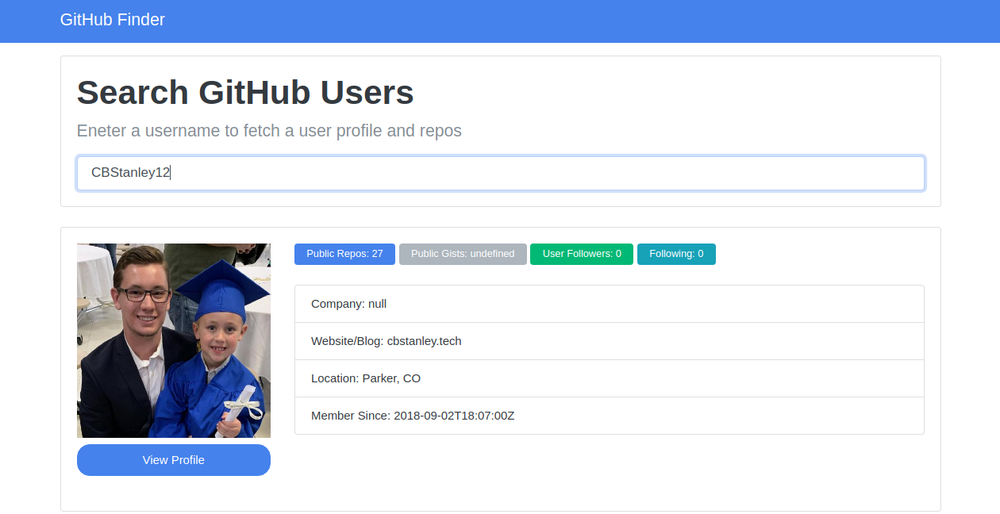
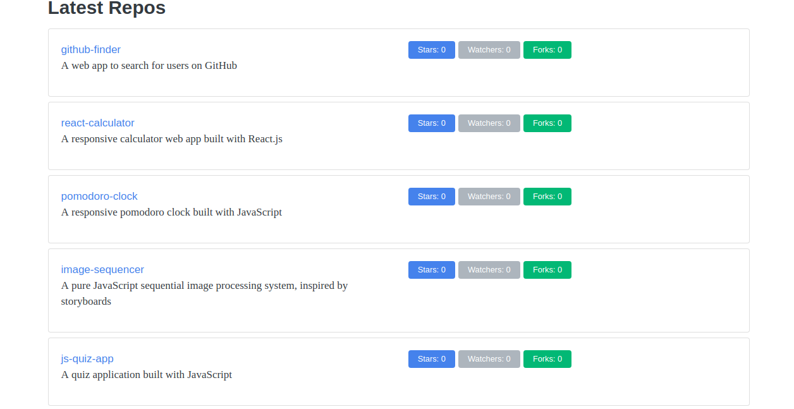

<h1 align="center">React Calculator</h1>

A web app to search for users on GitHub

## Table of Contents
* [Project Status](#project-status)
* [Features](#features)
* [Screenshots](#screenshots)
* [Technologies](#technologies)
* [Inspirations](#inspirations)
* [Contact](#contact)
* [License](#license)

## Project Status
This project is currently: _Complete_

## Features
Complete:
- [X] Search for users on GitHub
- [X] Display the user's profile information including public repos, public gists, follower count, and following count
- [X] Display the user's profile information including company, website, location, and date profile created
- [X] Display the user's five (5) most recent repositories

## Screenshots

## Technologies
Built with:
* JavaScript
* HTML
* CSS / Bootstrap
* GitHub API

## Inspirations
This project was built as part of Brad Traversy's Udemy course [Modern JavaScript from the Beginning](https://www.udemy.com/modern-javascript-from-the-beginning/).

## Contact
Twitter - [@CBStanley12](https://twitter.com/CBStanley12)

DEV - [cbstanley12](https://dev.to/cbstanley12)

Personal Website - [cbstanley.tech](https://cbstanley.tech)

## License
**MIT License**: 
A short and simple permissive license with conditions only requiring preservation of copyright and license notices. Licensed works, modifications, and larger works may be distributed under different terms and without source code.
